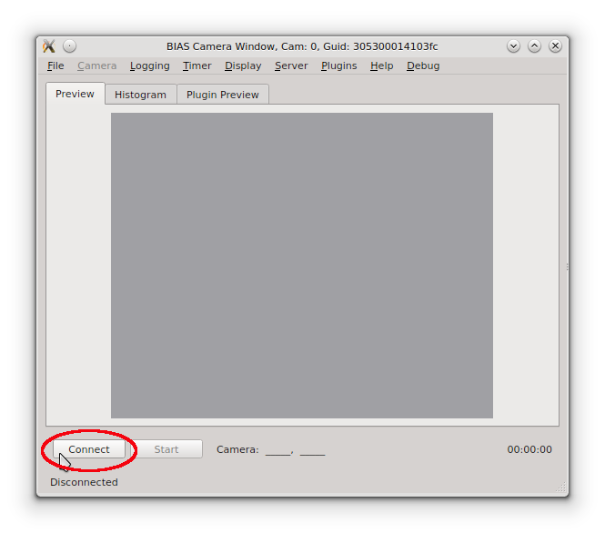
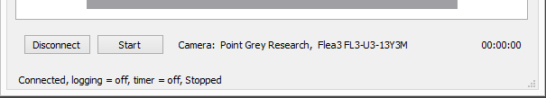
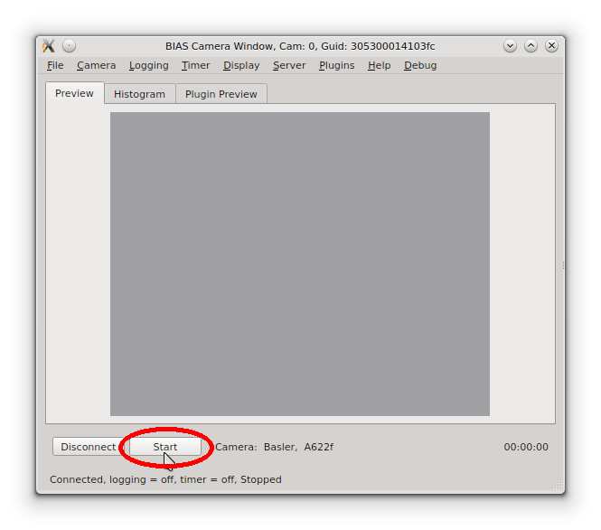
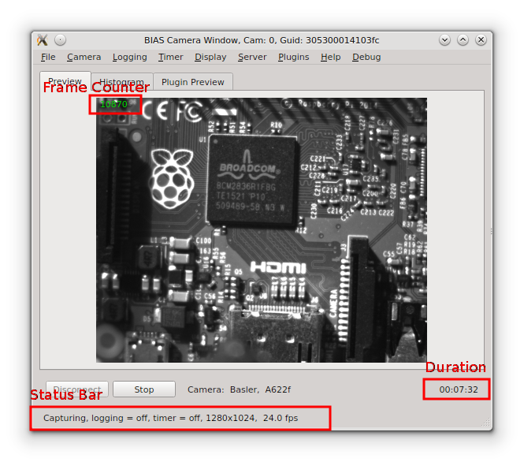
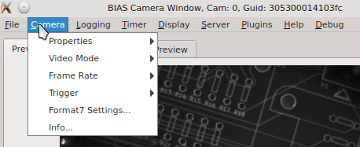
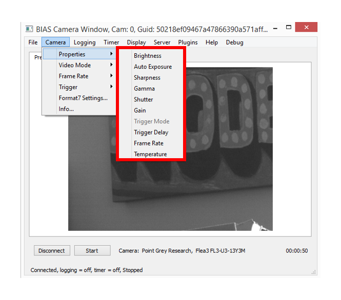
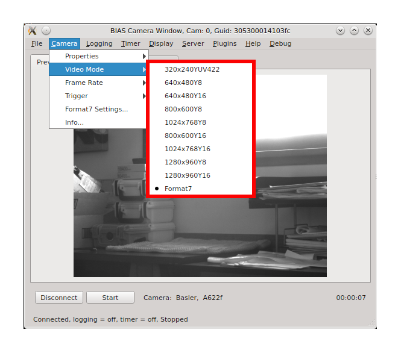
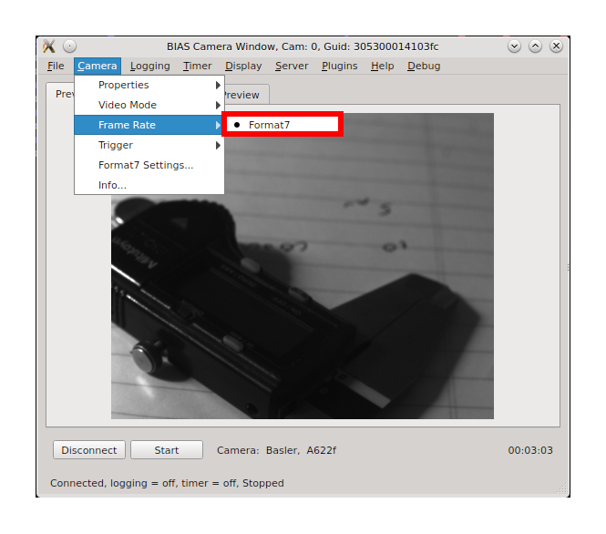
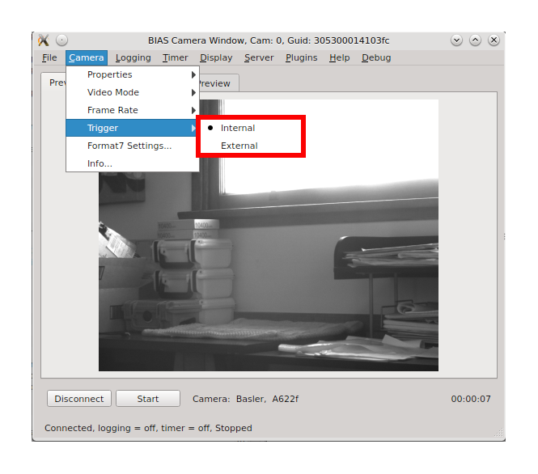

*******************
Basic Usage
*******************

* :ref:`basic_usage_connect_to_camera`
* :ref:`basic_usage_start_stop_capture`
* :ref:`basic_usage_camera_settings`
* :ref:`basic_usage_logging_settings`
* :ref:`basic_usage_save_load_configuration`

.. _basic_usage_connect_to_camera:

Connecting to a camera
-----------------------

When BIAS is started it will try to enumerate all compatible cameras which are
connected to the system. It will then open a separate GUI window for each
camera. In to lower left corner of each GUI window is a **Connect** button. 

camera. To connect to a camera press the **Connect** button at the bottom of
the GUI window. After connecting to the camera the  vendor and model of the
camera will be displayed in the text box to the right of the **Start** button
as shown in the example below.

Note, that after connecting to the camera the text on the **Connect** button
changes to **Disconnect** . This button can be used to disconnect from the
camera when you are finished using it.

.. _basic_usage_start_stop_capture:

Start/Stop image capture
-------------------------------

To start image capture press the **Start** button located in the lower corner
of the GUI window - just to right of the **Connect** button.

After image capture is started a live preview image will be shown on the
**Preview** tab of the camera's GUI window as shown below.

Notes: 

* A frame counter,  in the upper right corner of the preview image (green),  displays the number or frames captured.  
* The status bar, at the bottom of the window, shows the logging and timer status, the image size and the frame rate. 
* Duration of the current capture session is shown in the lower right corner.
* The text in the **Start** button will change to **Stop** and this button can now be used to stop image capture. 

.. _basic_usage_camera_settings:

Camera Settings
-----------------------------

The camera settings can be adjusted from the **Camera** menu located near the top of the GUI window.

.. figure:: _static/bias_camera_menu.png
   :align:  center

The **Camera** menu contains the following items

* Properties - gain, shutter, brightness, etc
* Video Mode - 640x480Y8, 1280x960Y8, 1280x960Y16, Format7, etc. 
* Frame Rate - 30Hz, 60Hz,  Format7, etc. 
* Trigger - either internal or external
* Format7 Settings - dialog for Format7 specific settings such as mode, pixel format and ROI.

Camera Settings - Properties
^^^^^^^^^^^^^^^^^^^^^^^^^^^^

The camera properties can be set via the **Camera -> Properties**
sub-menu item.  The cmaera properties include features such as: gain, shutter, brightness, sharpness, auto-exposure,
etc.  Note, the specific camera properties available will vary by camera model. 

Camera Settings - Video Mode 
^^^^^^^^^^^^^^^^^^^^^^^^^^^^^

The camera's video mode can be set via the **Camera -> Video Mode** sub-menu
item. The video mode setting allows the user to the mage size and pixel type.
The specific video modes available will depend on the camera model.  Note, BIAS
currently only supports the Format7 video mode.

Camera Settings - Frame Rate 
^^^^^^^^^^^^^^^^^^^^^^^^^^^^^
The camera's frame rate (when not in Format7 mode) can be set via the **Camera
-> Frame Rate** sub-menu item.  Note, this only applies to non-Format7 video
modes. In Format7 video mode this should be set 'Format7' as the frame rate in
Format7 mode is a camera and is set in the **Cameara -> Properties -> Frame
Rate** menu item.

Camera Settings - Trigger 
^^^^^^^^^^^^^^^^^^^^^^^^^^^^^
The type of triggering used when acquiring images can be selected via the
**Camera -> Trigger** sub-menu item.  There are two tigger options: *internal*
and *external*. When using internal trigger mode image acquistion is triggered
by the camera itself according to the current frame-rate setting. When using
external trigger mode, image acquisition is triggered using an external trigger
source - usually connected to a GPIO on the camera.

Camera Settings - Format7 Settings
^^^^^^^^^^^^^^^^^^^^^^^^^^^^^^^^^^
The camera's frame rate (when not in Format7 mode) can be set via the **Camera -> Frame Rate** sub-menu item.

.. _basic_usage_logging_settings:

Logging Settings
-----------------------------

.. _basic_usage_save_load_configuration:

Saving/loading configurations
------------------------------

