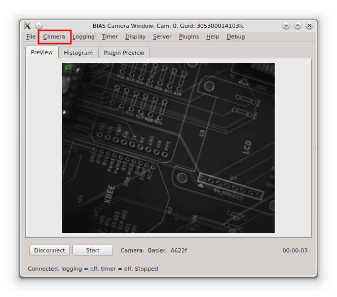
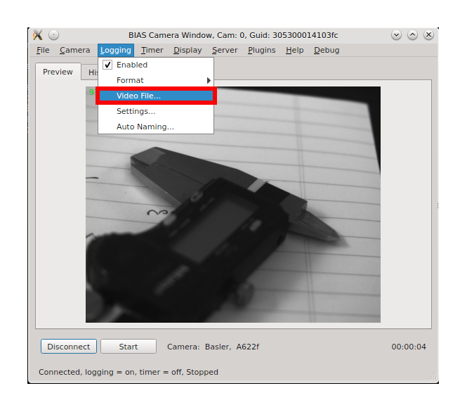
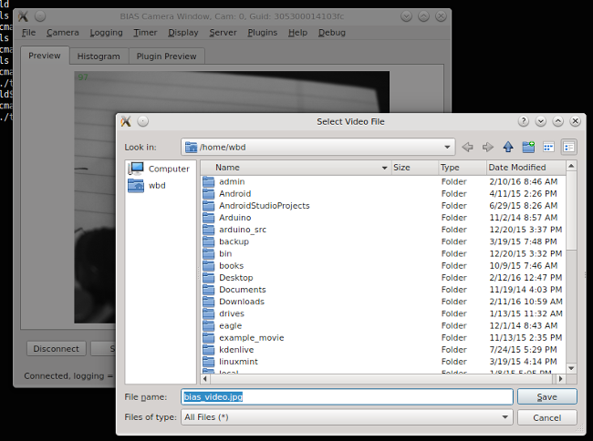
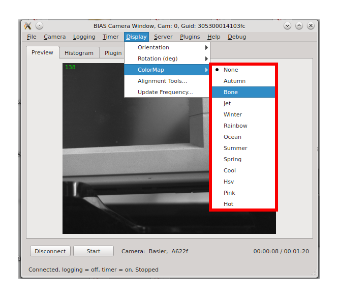

*******************
Basic Usage
*******************

* :ref:`basic_usage_save_load_configuration`
* :ref:`basic_usage_connect_to_camera`
* :ref:`basic_usage_start_stop_capture`
* :ref:`basic_usage_camera_settings`
* :ref:`basic_usage_logging_settings`
* :ref:`basic_usage_timer`
* :ref:`basic_usage_display`
* :ref:`basic_usage_server`
* :ref:`basic_usage_plugins`
* :ref:`basic_usage_help`

.. _basic_usage_save_load_configuration:

Saving/loading configurations
------------------------------

The current BIAS configuration, e.g. the camera, logging, timer, etc, settings
can be loaded/saved to/from a json file using the **File -> Load
Configuration...** and **File -> Save Configuration...** menu items. Note, the
camera must be connect in order to load/save the a configuration.

.. figure:: _static/bias_file_save_load_config.png
   :align:  center

An example of BIAS's json configuration format can be found here
:ref:`section_bias_json_config_example`.

.. _basic_usage_connect_to_camera:

Connecting to a camera
-----------------------

When BIAS is started it will try to enumerate all compatible cameras which are
connected to the system. It will then open a separate GUI window for each
camera. In to lower left corner of each GUI window is a **Connect** button. 

camera. To connect to a camera press the **Connect** button at the bottom of
the GUI window. After connecting to the camera the  vendor and model of the
camera will be displayed in the text box to the right of the **Start** button
as shown in the example below.

.. figure:: _static/bias_camera_vendor_and_model.png
   :align:  center

Note, that after connecting to the camera the text on the **Connect** button
changes to **Disconnect** . This button can be used to disconnect from the
camera when you are finished using it.

.. _basic_usage_start_stop_capture:

Start/Stop image capture
-------------------------------

To start image capture press the **Start** button located in the lower corner
of the GUI window - just to right of the **Connect** button.

After image capture is started a live preview image will be shown on the
**Preview** tab of the camera's GUI window as shown below.

Notes: 

* A frame counter,  in the upper right corner of the preview image (green),  displays the number or frames captured.  
* The status bar, at the bottom of the window, shows the logging and timer status, the image size and the frame rate. 
* Duration of the current capture session is shown in the lower right corner.
* The text in the **Start** button will change to **Stop** and this button can now be used to stop image capture. 

.. _basic_usage_camera_settings:

Camera Settings
-----------------------------

The camera settings can be adjusted from the **Camera** menu located near the top of the GUI window.

The **Camera** menu contains the following items

* Properties - gain, shutter, brightness, etc
* Video Mode - 640x480Y8, 1280x960Y8, 1280x960Y16, Format7, etc. 
* Frame Rate - 30Hz, 60Hz,  Format7, etc. 
* Trigger - either internal or external
* Format7 Settings - dialog for Format7 specific settings such as mode, pixel format and ROI.

.. figure:: _static/bias_camera_menu_items.png
   :align:  center

Properties
^^^^^^^^^^^

The camera properties can be set via the **Camera -> Properties**
sub-menu item.  The cmaera properties include features such as: gain, shutter, brightness, sharpness, auto-exposure,
etc.  Note, the specific camera properties available will vary by camera model. 

.. figure:: _static/bias_camera_prop_menu.png
   :align:  center

Video Mode 
^^^^^^^^^^^

The camera's video mode can be set via the **Camera -> Video Mode** sub-menu
item. The video mode setting allows the user to the mage size and pixel type.
The specific video modes available will depend on the camera model.  Note, BIAS
currently only supports the Format7 video mode.

.. figure:: _static/bias_camera_vidmode_menu.png
   :align:  center

Frame Rate 
^^^^^^^^^^^
The camera's frame rate (when not in Format7 mode) can be set via the **Camera
-> Frame Rate** sub-menu item.  Note, this only applies to non-Format7 video
modes. In Format7 video mode this should be set 'Format7' as the frame rate in
Format7 mode is a camera and is set in the **Cameara -> Properties -> Frame
Rate** menu item.

.. figure:: _static/bias_camera_framerate_menu.png
   :align:  center

Trigger 
^^^^^^^^
The type of triggering used when acquiring images can be selected via the
**Camera -> Trigger** sub-menu item.  There are two tigger options: *internal*
and *external*. When using internal trigger mode image acquistion is triggered
by the camera itself according to the current frame-rate setting. When using
external trigger mode, image acquisition is triggered using an external trigger
source - usually connected to a GPIO on the camera.

Format7 Settings ...
^^^^^^^^^^^^^^^^^^^^^
The Format7 Settings menu item,  **Camera -> Format7 Settings**, opens a dialog
which can be used to set the pixel format and region of interest (ROI) when
operating in the Format7 video mode.

The Format7 Settings dialog is shown below.

.. figure:: _static/bias_camera_format7_dialog.png
   :align:  center

The format7 settings include the follow:

* Format7 *Mode* and *Pixel Format*. Note, the exact format7 modes and pixel
  formats will depend upon the camera mode.

* The *Region Of Interest* (or ROI) - this  feature allows the user to restrict
  aquisition for a sub-region of the full image frame.  The ROI is specified by
  selecting  X Offset, Y Offset, X Width and Y Height. The ROI feature maybe
  set to  "off", "show", or "enable". When set to "off" the full image frame is
  captured. When set to "enable" the sub-region selected will be shown as a red
  rectangle in the preview window. When set to "enable" image capture is
  restriced to the selected sub-region.  

The example below demonstrates how the ROI sub-region is displayed in red on the
full image when "show" is selected in the Format7 Settings dialog.

|

.. figure:: _static/bias_camera_format7_ROI_show_example.png
   :align:  center

.. _basic_usage_logging_settings:

Logging Settings
-----------------------------

Enabled
^^^^^^^^

Logging can be enabled via the  **Logging -> Enabled** menu item as illustrated
in the image below.

Format
^^^^^^^

BIAS supports several different logging file formats (bmp, jpg, avi, fmf, ufmf)
which can be selected via the **Logging -> Format** sub-menu.

.. figure:: _static/bias_logging_format_menu.png
   :align:  center

Video File ...
^^^^^^^^^^^^^^^

The name of the output video file (or directory of files depending on the file
format) can be selected via the **Logging -> Video File...** menu item.

After selecting this item a standard file selection dialog will appear with which you can select
the desired video file or directory.

|

Settings ...
^^^^^^^^^^^^^

The settings specific to each logging format can be adjusted via the **Video
Logging Settings** dialog. This dialog is opened via the **Logging ->
Settings...** menu item.

.. figure:: _static/bias_logging_settings_menu.png
   :align:  center

The **Video Logging Settings** dialog contains a tab for logging format and
should open on the tab of the currently selected format. The tab contains all
of the configurable options for the given file format. A detailed description
of these options, for each format, can be found here [TO DO].

|

.. figure:: _static/bias_logging_settings_dialog.png
   :align:  center

Auto Naming ...
^^^^^^^^^^^^^^^^

BIAS supports several autonaming options which automatically add information to
the video filename e.g. time, date, camera number or GUID, etc. The autonaming
options can set via the **Video File: Auto Naming** dialog. This dialog can be
opened by selecting the **Logging -> Auto Naming...** menu item.

.. figure:: _static/bias_logging_autonaming_menu.png
   :align:  center

|

The **Video File: Auto Naming** is shown below.

The dialog contains three checkable items:

* Camera Identifier: adds either the camera Global Unique
  Identifier (GUID) or camera number to the logging file/directory name.

* Time and Date: add time and date information to the file/directory name. Time
  and date format is selectable via a drop down menu.

* Version Number: adds version number to the file name e.g. 1,2, ...  This
  option is is useful to prevent video files from being over written when they
  have the same name.

.. _basic_usage_timer:

Timer 
---------

BIAS's capture timer can be used to create timed video acquisitions.

Enabled
^^^^^^^^

The capture timer can be enabled via the **Timer -> Enabled** menu item. Note,
when the capture timer is enabled the "duration" text label in the lower right
corner will be split to show both the ellapsed capture time and total capture duration
as set int the timer settings as follows:  "ellapsed time/total capture duration".

Settings
^^^^^^^^

The timer settings can be specified via the **Timer Settings** dialog. This dialog
can be opened by selecting the **Timer -> Settings...** menu item.

.. figure:: _static/bias_timer_settings_dialog.png
   :align:  center

The total capture duration is specified in hours (hr), minutes (min) and seconds (sec). 

.. _basic_usage_display:

Display
---------

The display menu provides options for changing how the image preview appears to
the user.  The available options include orientation, rotation, colormap, as
well as several alignment tools. 

Orientation
^^^^^^^^^^^^

The orientation sub-menu provides the user with options to flip the preview
image either vertically and/or horizontally.  To flip the image check the
corresponding checkbox in the sub-menu item.

Rotation
^^^^^^^^^^^^

The rotation sub-menu provides the user with options to rotate the preview
image either 0, 90, 180 or 270 degrees. A dot is shown next to the current
rotation setting. 

ColorMap
^^^^^^^^^^^^
The colormap sub-menu provides the user with a list of colormap which can be
applied to the preview window. The list of options include: None (no colormap),
Autumn, Bone, Jet, Winter, Rainbow, Ocean, Summer, Spring, Cool, Hsv, Pink, and
Hot.

Alignment Tools...
^^^^^^^^^^^^^^^^^^^

The alignment tools menu item opens the **Alignment Tools** dialog which
contains several tools which can be used to help during camera alignment.

The alignment tools dialog current contains two tools: Grid and Ellipse. 

The Grid alignment tools allows the user to display a grid of lines on the
preview image. The user can choose the color and number of grid lines. An example of 
preview image with an alignment grid (color = orange, row = 3, col = 2) is shown below.

The Ellipse alignment tool allows the user to display an ellipse on the preview
image. The user can choose the color and shape and position of the ellipse.
Note, the ellipse alignment tool is not yet fully implemented.

.. _basic_usage_server:

Server
---------

BIAS is capable of running a simple http server which enables control of the
software via http requests from external applications.  Documentation for the
http commands can be found here :ref:`section_ext_control_http_cmds` The
**Server** menu contains the controls and settings for this server.

Enabled
^^^^^^^^^^^^

The enabled menu item allows the user to enable/disable the external control
server. When the checkbox is ticked the external control http server is
enabled - this is the default setting. 

Port
^^^^^^^^^^^^

The port menu item opens the **HTTP Server Settings** dialog. Note, this is not
yet implemented. Currently on the port for the specific camera is displayed
next to the **Settings...** menu item.

Commands
^^^^^^^^^^^^

The commands menu item opens a window with a summary of the external control
server commands. Note, this is not yet implemented.

.. _basic_usage_plugins:

Plugins
----------

The plugins menu contains controls for enabling, configuring and selecting plugins.

Enabled
^^^^^^^^^^^^

The enabled menu item allows the user to enable the currently selected plugin.
When the checkbox is ticked the plugin is enabled. Note, the currently selected
plugin is shown in the plugin list at the bottom of the plugin menu.

Settings...
^^^^^^^^^^^^

Opens the settings dialog for currently selected plugin.  Note, each plugin
will have its own settings dialog.

An example of the  settings dialog for the Grab Detector plugin is shown below.

Plugin List
^^^^^^^^^^^^

The plugin list is shown at the bottom of the plugin menu - separated from the
rest of the menu via a horizontal line. The plugin list show all currently
available plugins.  A dot is show next to the currently active plugin. Note,
only one plugin may be active at an time.

.. _basic_usage_help:

Help
----------

The help menu provides link to various help resources.

User Manual...
^^^^^^^^^^^^^^^^

The user manual menu items opens a browser window open to BIAS's documentation.
Note, this is not yet implemented.

About...
^^^^^^^^^^^^^^^^

Opens the about dialog showing the current version number of the software etc.
Note, this is not yet implemented.

