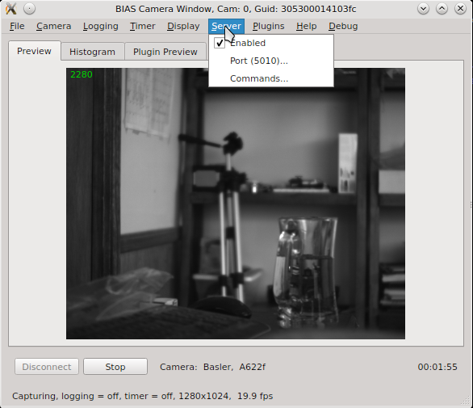

.. _section_ext_control_http_cmds:

*********************************************
External Control HTTP Commands
*********************************************

BIAS can be controlled via external HTTP commands when the external control
server is enabled. The can be done by checking the "Enabled" item under the
"Server" menu as shown below.

The port number used by the external control server, when enabled, is shown in
the second menu item - e.g. Port(5010).

Basic Command Structure
=======================

Commands are sent using http GET request as follows:

.. code-block:: none 

   http://localhost:5010/?<commandName>=<commandArgs>
    
where "commandName" is the name of the and "commandArg" is the command argument
(possibly empty).  In this example the "localhost" is used for the devie
address and the port is assumed to be 5010. The local computers IP address may
used in place of "localhost". 

As an example consider the "stop-capture" command which instructs BIAS to stop
capturing images from the camera. This command can be issued as follows: 

.. code-block:: none 

    http://localhost:5010/?connect

In response to each command BIAS will return a JSON object containing the name
of the command, a flag indicating the success or failure of the command, a
message indicating the reason for failure (if failure occurred), and the
desired response value (if successful).  For example, the response to a
successful "set-video-file" command would be as follows: 

.. code-block:: javascript

    { 
        "command" : "set-video-file", 
        "message" : "", 
        "success" : true, 
        "value" : "" 
    }

BIAS Commands
==============

This list of commands accepted by BIAS is as follows:
:ref:`section_win_install_gcc`

* :ref:`section_cmd_connect`
* :ref:`section_cmd_disconnect`
* :ref:`section_cmd_start-capture`
* :ref:`section_cmd_stop-capture`
* :ref:`section_cmd_get-configuration`
* :ref:`section_cmd_set-configuration`
* :ref:`section_cmd_enable-logging`
* :ref:`section_cmd_disable-logging`
* :ref:`section_cmd_load-configuration`
* :ref:`section_cmd_save-configuration`
* :ref:`section_cmd_close`
* :ref:`section_cmd_get-frame-count`
* :ref:`section_cmd_get-camera-guid`
* :ref:`section_cmd_get-status`
* :ref:`section_cmd_set-video-file`
* :ref:`section_cmd_get-video-file`
* :ref:`section_cmd_get-time-stamp`
* :ref:`section_cmd_get-frames-per-sec`
* :ref:`section_cmd_set-window-geometry`
* :ref:`section_cmd_get-window-geometry`
* :ref:`section_cmd_plugin-cmd`

.. _section_cmd_connect:

connect   
-------
Connect to the camera which is associated with the given BIAS camera window
(specified by port address).

.. code-block:: none 

   http://localhost:5010/?connect

.. _section_cmd_disconnect:

disconnect
----------
Disconnect from the camera which is associated with the given BIAS camera
(specified by port address).

.. code-block:: none 

   http://localhost:5010/?disconnect

.. _section_cmd_start-capture:

start-capture
-------------
Starts image capture on the associated camera. Note, the camera must be
connected for the command to be successful. 

.. code-block:: none 

   http://localhost:5010/?start-capture

Note, the current connection status of the camera can be queried using
:ref:`section_cmd_get-status` command.

.. _section_cmd_stop-capture:

stop-capture
------------
Stops image capture on the associated camera. 

.. code-block:: none 

   http://localhost:5010/?stop-capture

.. _section_cmd_get-configuration:

get-configuration
-----------------
Returns the current BIAS configuration in the json format (all GUI and camera settings).

.. code-block:: none 

   http://localhost:5010/?get-configuration

An example of the typical data returned by this command can be found here
:ref:`section_bias_json_config_example`. Note, the camera must be connected for
this command to be successful.

.. _section_cmd_set-configuration:

set-configuration
-----------------
Sets the configuration of the associated GUI window and camera (specified by
port address) to that given by the json configuration provided in the command
argument.

.. code-block:: none

    http://localhost:5010/?set-configuration=<json configuration object>

Note, the camera must be connected for this command to be successful. In
addition the configuration data must be valid for the users camera make and
model.  An example of setting the configuration for a Point Grey Flea3
FL3-U3-13Y3M camera is shown  below.  

.. literalinclude:: _static/set_config_http_example.txt 
   :language: bash
    

.. _section_cmd_enable-logging:

enable-logging
---------------
Enable logging of video data to data file. This command is equivalent to
checking the "Logging -> enabled" checkbox. 

.. code-block:: none

    http://localhost:5010/?enable-logging

Note, logging cannot be enabled during image capture. In order to enable
logging the current capture (if running) must be stopped - via the
:ref:`section_cmd_stop-capture` command or equivalent. Then logging may be
enabled and capture resumed.  Attempting to enable logging during capture will
return an error as follows:

.. code-block:: javascript

    { 
        "command" : "enable-logging", 
        "message" : "Unable to enable logging: capturing images", 
        "success" : false, 
        "value"   : "" 
    }

.. _section_cmd_disable-logging:

disable-logging
---------------
Disable logging of video data. This command is equivalent to unchecking the
"Logging -> enabled" checkbox.

.. code-block:: none

    http://localhost:5010/?disable-logging

Note, logging cannot be disabled if image capture has been started. In order to
disable logging it is necessary to first capturing images via the
:ref:`section_cmd_stop-capture` command or similar. Attempting to disable
logging during capture will return an error as follows:

.. code-block:: javascript

    { 
        "command" : "disable-logging", 
        "message" : "Unable to disable logging: capturing images", 
        "success" : false, 
        "value"   : "" 
    }

.. _section_cmd_load-configuration:

load-configuration
------------------
Load and set the BIAS configuration from the file given as an argument.

.. code-block:: none

    http://localhost:5010/?load-configuration=<json configuration file>

Note, the camera must be connected for the command to be successful. An example
of the command for a configuration file name "bias_config.json" located in
"C:\Users\Will\Documents" is given below.

.. code-block:: none

    http://localhost:5010/?load-configuration=C:\Users\Will\Documents\bias_config.json

.. _section_cmd_save-configuration:

save-configuration
------------------
Save the current BIAS configuration to the specified file.

.. code-block:: none

    http://localhost:5010/?save-configuration=<json configuration file>

Note, the camera must be connected for the command to be successful. An
example of the command for creating a configuration file named "my_config.json"
in the "C:\Users\Will\Documents" directory is a given below.

.. code-block:: none

    http://localhost:5010/?save-configuration=C:\Users\Will\Documents\my_config.json

.. _section_cmd_close:

close
-----
Closes the BIAS camera window (specified via port address). 

.. code-block:: none

    http://localhost:5010/?close

Note, the BIAS camera window cannot be closed using this command if image
capture has been started.  

.. _section_cmd_get-frame-count:

get-frame-count
---------------
Returns the current frame count from the associate BIAS camera window.

.. code-block:: none

    http://localhost:5010/?get_frame-count

The frame count is returned in the "value" field of the response. An example
response is given below.

.. code-block:: javascript

    { "command" : "get-frame-count", "message" : "", "success" : true, "value"   : 209 }

.. _section_cmd_get-camera-guid:

get-camera-guid
---------------

Returns the camera's GUID (Globally Unique Identifier). 

.. code-block:: none

    http://localhost:5010/?get-camera-guid

The GUID of the camera is returned in the "value" field of the response. An
example response is given below.

.. code-block:: javascript

    { "command" : "get-camera-guid", "message" : "", "success" : true, "value" : "305300014103fc" }

.. _section_cmd_get-status:

get-status
----------
Returns status information for the BIAS application in JSON format.

.. code-block:: none

    http://localhost:5010/?get-status

The status information is returned in the "value" field of the response. The
information includes following fields:

* capturing   - true/false indicating  whether or not the camera is connected, 
* connected   - true/false indicating whether or not the camera is currently capturing images, 
* frameCount  - integer giving the current frame count, 
* framePerSec - double specifing the current frame rate,
* logging     - true/false indicating whether or not logging is enabled
* timeStamp   - the current time stamp.

An example response is given below.

.. code-block:: javascript

    { 
        "command" : "get-status", 
        "message" : "", 
        "success" : true, 
        "value"   : { 
            "capturing"    : true, 
            "connected"    : true, 
            "frameCount"   : 91, 
            "framesPerSec" : 149.0, 
            "logging"      : false, 
            "timeStamp"    : 4.58 
        } 
    }
 

.. _section_cmd_set-video-file:

set-video-file
--------------
Sets the current video file name for logging.

.. code-block:: none
    
    http://localhost:5010/?set-video-file=<video file name>

Note, video file name must specify the full path to the desired video file. The
target directory must exist. Any file extension is ignored - BIAS will set this
based on the current video file format. For example, setting the video file to
"my_video_file" located in "C:\Users\Will\Documents" can be accomplished as
follows:

.. code-block:: none

    http://localhost:5010/?set-video-file=C:\Users\Will\Documents\my_video_file
    

.. _section_cmd_get-video-file:

get-video-file
--------------
Returns the full path to the currently specified video file.

.. code-block:: none

    http://localhost:5010/?get-video-file

The video file name is returned in the value field of the response. An example
response is given below:

.. code-block:: javascript

    { 
        "command" : "get-video-file", 
        "message" : "", 
        "success" : true, 
        "value" : "C:/Users/Will/Documents/my_video_file.ufmf" 
    }

.. _section_cmd_get-time-stamp:

get-time-stamp
--------------
Returns the current image capture time stamp.

.. code-block:: none

    http://localhost:5010/?get-time-stamp

The time stamp is return in the value field of the response and in is units
(sec). An example response is given below. 

.. code-block:: javascript

    { 
        "command" : "get-time-stamp", 
        "message" : "", 
        "success" : true, 
        "value"   : 8.3555820000000000647 
    } 

.. _section_cmd_get-frames-per-sec:

get-frames-per-sec
------------------
Returns the  (measured) frame rate for the current capture (zero otherwise).  

.. code-block:: none

    http://localhost:5010/?get-frames-per-sec

The frame rate (in seconds) is returned in the "value" field of the response.
An example response is given below.

.. code-block:: javascript

    { 
        "command" : "get-frames-per-sec", 
        "message" : "", 
        "success" : true, 
        "value"   : 149.5 
    }

.. _section_cmd_get-window-geometry:

get-window-geometry
-------------------
Returns the current (GUI) camera window geometry - i.e. the x position, y position,  width and height in pixels.

.. code-block:: none

    http://localhost:5010/?get-window-geometry

The window geometry information is returned in the "value' field of the
response. An example response is given below.

.. code-block:: javascript

    { 
        "command" : "get-window-geometry", 
        "message" : "", 
        "success" : true, 
        "value"   : { 
            "height" : 479, 
            "width"  : 581, 
            "x"      : 1099, 
            "y"      : 23 
        } 
    }

.. _section_cmd_set-window-geometry:

set-window-geometry
-------------------
Sets the geometry for the current camera window GUI. 

.. code-block:: none 

    http:://localhost:5010/?set-window-geometry=<window geometery json data>

The window geometry data is specified in the json format as shown below

.. code-block:: javascript

    { 
        "height" : 479, 
        "width"  : 581, 
        "x"      : 1099, 
        "y"      : 23 
    } 

An example demonstrating how to set the window geometry is as follows

.. code-block:: none

    http://localhost:5010/?set-window-geometry={"height":600,"width":600,"x":1000,"y":100} 

.. _section_cmd_plugin-cmd:

plugin-cmd
----------
Runs a command specific to a BIAS plugin.  For example

.. code-block:: none

    http://localhost:5010/?plugin-cmd={"plugin":<plugin name>,"cmd": <command name>, <optional cmd args>}}

The <plugin name>, <command name> and  <optional arguments> are specific to the
given plugin. In general different plugins will different commands available. 

.. _section_cmd_set-camera-name:

Grab Detector Plugin Commands
=============================

The list of available commands for the grab detector plugin are given below.

* :ref:`section_plugin_cmd_grab_detector_connect`
* :ref:`section_plugin_cmd_grab_detector_disconnect`
* :ref:`section_plugin_cmd_grab_detector_reset`
* :ref:`section_plugin_cmd_grab_detector_set-config`

.. _section_plugin_cmd_grab_detector_connect:

connect
-------
Connects the grab detector plugin to the trigger device hardware.

.. code-block:: none

    http::/localhost:5010?/plugin-cmd={"plugin":"grabDetector","cmd": "connect"}

.. _section_plugin_cmd_grab_detector_disconnect:

disconnect
----------

Disconnects the grab detector plugin from the trigger device hardware.

.. code-block:: none

    http://localhost:5010?/plugin-cmd={"plugin":"grabDetector","cmd":"disconnect"}

.. _section_plugin_cmd_grab_detector_reset:

reset
-----
Resets (re-enables) the grab detector hardware trigger

.. code-block:: none

    http://localhost:5010?/plugin-cmd={"plugin":"grabDetector","cmd":"reset"}

.. _section_plugin_cmd_grab_detector_set-config:

set-config
----------
Set the grab detector plugin's configuration

.. code-block:: none

    http://localhost:5010/?plugin-cmd={"plugin":"grabDetector","cmd":"set-config","config":<config-json>}
    
where <config-json> is a JSON object containing the desired plugin configuration parameters. An example is 
given below:

.. code-block:: javascript

    { 
        "detectBox" : {
            "color" : "ff0000",
            "height" : 100,
            "width" : 100,
            "xPos" : 0,
            "yPos" : 0 
        },
        "device" : {
            "autoConnect" : false,
            "outputPin" : 4,
            "portName" : "ttyUSB0",
            "pulseDuration" : 0.02 
        },
        "trigger" : {
            "armedState" : true,
            "enabled" : true,
            "medianFilter" : 3,
            "threshold" : 100 
        }
    }

