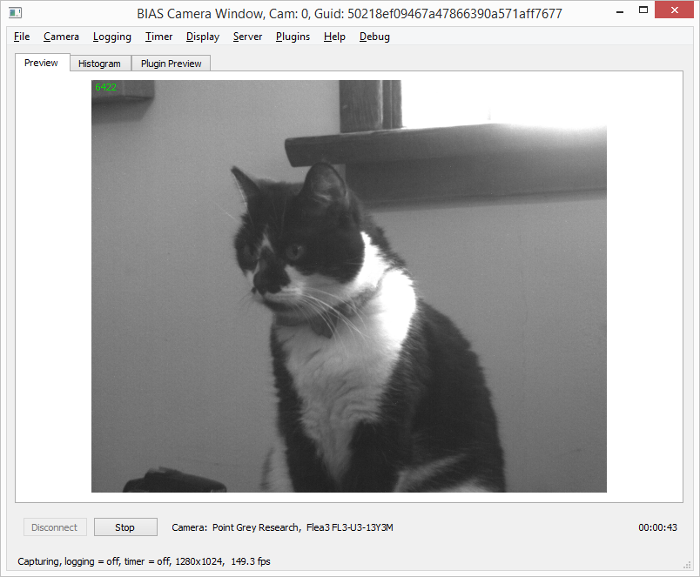
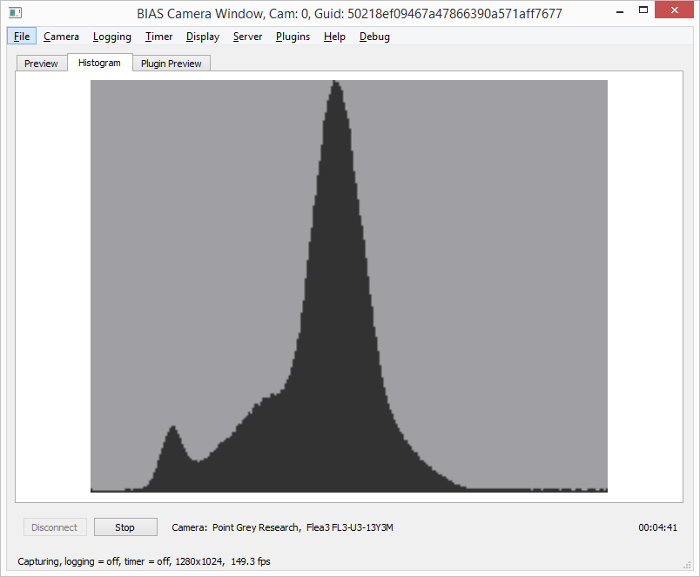
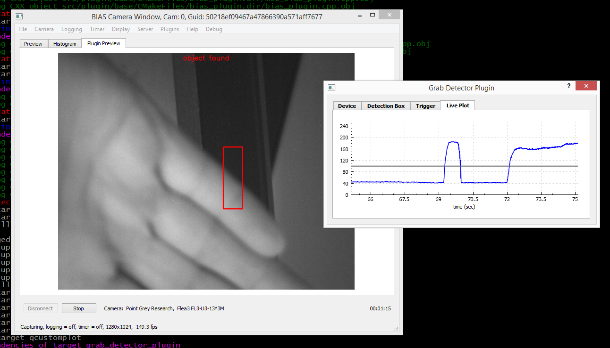

****************************
Introduction
****************************

**BIAS -  Basic Image Acquisition Software**

BIAS is a software application for recording video from IEEE 1394 and USB3
Cameras.  BIAS was intially designed as image acquisition software for
experiments in animial behavior. For example, recording the behavior of fruit
flies in a walking arena. 

Features
---------

BIAS provides the following features: 

* Control of camera properties (brightness, shutter, gain, etc.)
* Timed video recordings
* Support for a variety of video file formats (avi,fmf, ufmf, mjpg, raw image files) etc. 
* JSON based configuration files 
* External control via http commands - start/stop recording, set camera configuration etc.
* A plugin system for machine vision applications and for controlling external instrumentation
* Multiple cameras
* Image alignment tools
* Cross platform - windows, linux

Examples of the BIAS's basic camera control window is show below.

**Preview Tab**

**Histogram Tab**

Plugin system
-------------

BIAS's plugin system enables the deveolopment of custom machine vision
applications and control of external intrumentation. Plugins can be developed
where external instrumentation is triggered based in realtime image processing
alogorithms. For exmaple, triggering a laser an object is detected in a
particular region of the image.

**Example plugin GUI**

Backends
---------

BIAS support to different backends for accessing the cameras

* Point Grey's FlyCapture2  http://www.ptgrey.com/flycapture-sdk 
* libdc1394 http://damien.douxchamps.net/ieee1394/libdc1394/

Note, BIAS can only use one backend at a time and the software must be compiled
for use with the backend.
